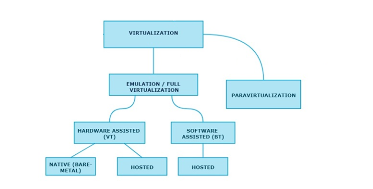

**주의**

개인이 학습한 내용을 정리한 글입니다. 잘못된 내용이 있을 수 있습니다.

잘못된 내용은 피드백주시면 반영하도록 하겠습니다.

**개정 이력**

이 글은 다음과 같이 업데이트 되었습니다.

\- 2020.06.27 : (Naver blog)KVM, QEMU 추가

\- 2020.06.29 : (Naver blog)Baremetal, Hosted, 전가상화, 반가상화 개념도 수정.

\- 2021.04.26 : AWS AMI 추가, 전반적 내용 수정

# 1. 가상화

가상화란 한 대의 시스템 하드웨어를 논리적으로 분할하여 가상의 시스템에 활용하는 개념이다.

가상 시스템들은 서로 독립적인 하나의 시스템으로 인지되기 때문에 주어진 하드웨어 리소스를 효율적으로 사용할 수 있다.

새로운 하드웨어 자원을 구비하고 시스템을 구축하는 것 보다 있는 자원을 활용하기 때문에 비교적 간결하고 쉽게 시스템을 올릴 수 있다.

호스트 OS를 기저에 두고 호스트를 중앙 시스템으로 하는 중앙 집중형의 서비스를 구축하기에 적절하다.

가상화를 이야기 하려면 하이퍼바이저(Hypervisor)를 빼 놓을 수 없는데, 가상 OS와 실제 하드웨어 자원 사이에 위치하며 둘 사이의 괴리를 조정해주는 역할을 하는 것으로 볼 수 있다.

이 과정을 '추상화'라고 하는데, 물리적인 하드웨어 자원을 소프트웨어적으로(가상으로)나누고, 나누어진 가상의 하드웨어를 진짜 하드웨어처럼 인지시키는 과정(즉, 하이퍼바이저의 역할)을 의미한다.

# 2. 시스템 가상화

가상 머신을 만들어서 운영체제를 설치하고 서비스를 구성하여 가상 환경 위에 서비스를 위한 시스템을 구축하는 것을 시스템 가상화라고 한다.

우리가 흔히 말하는 시스템가상화를 위한 기술은 2000년대 초반에 VMware사에서 내 놓으나, 가상화의 아이디어 자체는 메인프레임 시절부터 존재했다. 일반 PC에서 하드한 작업을 하지 않으면 PCU나 메모리가 놀게 되고, 전력도 적게 공급된다. 하지만 서버급 시스템은 언제나 최상의 성능을 유지해야 하고, 가뜩이나 비싼 비용을 들여 구비한 서버의 리소스가 놀면 놀수록 유휴 자원으로 분류되는 셈이다. 따라서 서버를 구매한 사용자는 서버가 놀지 않고 항상 최상의 성능을 내어주기를 희망할 것이며, 이를 위해서는 그만큼 전력도 많이 공급되어야 했다.

사용자들은 CPU와 메모리가 놀도록 여유를 두기 보다는 동시에 여러 개의 애플리케이션을 동작시키기를 희망했다. 그러나 이렇게 하나의 서버 시스템에서 여러 개의 애플리케이션을 동작시키고 모조리 관리하게 되면 서비스에 장애가 발생함으로 인해 다른 애플리케이션들이 영향을 받게 되면서 결과적으로모든 서비스가 일제히 중단될 위험이 있었고, 여기서 가상화의 개념이 출발했다.

하드웨어 리소스를 나누어 사용해서 활용도를 최대로 끌어내면서도 장애 발생시 상호간에 영향을 최소화 하는 것이 중요했다. 때문에 가상화의 ***\*핵심\****은 Isolation 이다. 하나의 물리적 장치를 논리적으로 나누어 격리시킨다는 의미를 내포한다. 제대로 격리가 이루어진다면 하나의 가상 시스템 안에서 문제가 발생하더라도 그 밖에 다른 영역으로 영향을 미치지 않는다는 장점을 갖는다.

메인프레임 시절의 하드웨어 레벨의 가상화와는 달리 현재 쓰이는 소프트웨어적인 가상화를 위한 기술로 Hypervisor가 있다. HyperVisor를 사용하는 여러 가상 프로그램으로 앞서 언급된 VMware가 출시되어 독주해왔고, 이후로 KVM, Xen과 같은 후발주자들이 나타나게 된다.

# 3. Protection Ring

****

외부로부터의 공격을 방어하고 내부의 데이터와 기능을 보호하여 내결함성을 확보하기 위한 **계층 권한 메커니즘**이다. 쉽게 말하자면 바깥 링에서 안쪽 링으로 들어가기 위해서는 반드시 순서대로 권한을 획득해야만 접근 가능하도록 설계한 모델이다. OS(Kernel) 레벨이 Ring 0에 위치해있다. Ring1과 Ring2는 Device Driver의 권한을 배치하였고 가장 바깥쪽 Ring 3에는 사용자와 밀접한 Application 레벨이 되겠다. 대표적으로 Intel의 x86 아키텍처가 이러한 구조를 가지고 있으며, Previlige level로 불린다. 현대에 와서는 실질적으로 Ring 0과 Ring 3만 유의미하게 쓰이고 있다.

시스템 동작을 위한 핵심이 되는 소수의 어셈블리 명령어만이 Ring 0에서 실행될 수 있도록 권한으로 제어하고 있다. 운영체제 강의를 조금만 들어봐도 나오는 이야기지만 커널 레벨의 기능을 유저 레벨에서 아무렇게나 사용할 수 없도록 하기 위함이다. 시스템 프로그래밍을 할 때 사용하게 되는 시스템 함수들을 이용해서 Ring 0와 Ring3를 넘나드는 함수 사용을 요청할 수 있는 것으로 이해하고 넘어가면 충분하다. 리눅스 환경에서 흔히 쓰이는 sudo도 같은 맥락이다.

# 4. 가상화의 유형

Ring protection을 바탕으로 운영체제의 동작상태를 계층적으로 표현해보면, 일반적인 x86시스템은 좌측과 같은 상태이며 유닉스 메인프레임에서는 아직도 우측과 같은 하드웨어 파티셔닝(하드웨어 레벨의 가상화)이라는 가상화 기술을 사용하고 있다.

가상화는 최근에 나온 새로운 기술이 아니라, 과거에 이미 IBM에서 메인프레임의 자원을 낭비하지 않기 위해 하드웨어 파티셔닝이라는 가상화 기술을 만들면서 시작되었다고 했다. 이 하드웨어 파티셔닝 기법은 유닉스 메인프레임에서만 사용할 수 있었고, 일반 x86 아키텍처에서는 사용할 수 없었다. 그래서 개발된 개념이 소프트웨어 파티셔닝 기법인 하이퍼바이저(Hypervisor) 기반의 가상화 기술이다.

이 모든 가상화 방식을 전부 다루기에는 학습할 양도 방대하고, 내가 학습할 필요성을 못 느끼기에 이 글에서 다룰 가상화 유형의 범위는 다음과 같다.

크게 전체를 가상화하느냐, 일부만 가상화하고 나머지는 실제 하드웨어를 그대로 사용하느냐에 따라 가상황 유형을 구분한다. 2000년대 후반까지 가상화 기술이 급속도로 발전하면서 Full virtualization에는 VMware, Para Virtualization에는 Xen이 대표주자로서 대립하는 양상을 띄었으나 현재에 와서는 결국 전 가상화와 반 가상화를 모두 지원하기에 이르렀다.

## 4-1. 전 가상화(Full Virtualization)

전 가상화를 통해 만들어진 가상 머신의 커널은 자신이 가상 머신의 커널인지 인지하지 못 한다. 전 가상화에서 Hypervisor의 역할은 **'하드웨어를 전부 가상화 시켜주고 가상의 하드웨어 정보를 VM의 커널에게 전달해서 하드웨어 요청이 필요하면 실제 하드웨어가 아닌 가상의 하드웨어에 요청'**할 수 있도록 하는 것이다.(너무 긴가..?) 이 때 Hypervisor는 일반 OS처럼 패키지를 설치하는 등의 추가동작은 하지 않는다. 정확히 정해진 동작만 수행하는 일종의 minimal OS로 보면 이해가 쉽다. 

즉, 전 가상화는 모든 하드웨어를 전부 가상화 시켜서 논리적으로 배분하는 것이다. 하드웨어와 VM 커널 사이에 Hypervisor단이 있기는 하나, 이미 VM은 가상화된 하드웨어를 진짜 하드웨어로 인지하고 있기 때문에 실제 물리 자원에 대한 요청을 보낸다고 생각한다. VM이 보는 시점에서 Hypervisor 레벨이 커널-하드웨어 레벨로 보이게 되며, 실제로도 Hypervisor 단에서 트랩과 에뮬레이션을 처리하게 되는데 이 과정에서 오버헤드가 발생한다. 원래 시스템콜에 의해 발생해서 앱->커널->하드웨어 순으로 갔어야 흘러갔어야 하는 트랩을 Hypervisor 단에서 처리하게 되고, 하드웨어의 논리적 분배를 위한 소프트웨어적인 동작인 에뮬레이션(Emulation)까지 처리하면서 발생하는 성능저하이다.

여기서 에뮬레이션이나 Binary translation은 같은 의미이다. 예를 들면 Guest OS는 다양한 종류의 OS가 쓰일 수 있다. 그런데 Guest OS에서 가상화된 하드웨어에 요청하려고 할 때 서로 다른 OS인 윈도우와 리눅스가 서로 같은 형식으로 요청을 보내지는 않을 것이다. 이 형식을 Hypervisor가 알아들을 수 있는 하나의 형식으로 번역해주는 작업을 Binary Translation이라고 한다. 다양한 OS를 올릴 수 있는 대신에 오버헤드라는 단점이 생기는 것으로 이해하면 된다.

여기에 더해, 윈도우에 도커 데스크탑을 설치하다 보면 바이오스 화면에서 한 번쯤은 보았을 텐데, Intel CPU의 VT-x, AMD CPU의 AHD-V가 Binary translation을 CPU에서 소프트웨어적으로 가능하게 해주는 기술이다.(VT-x, AHD-V에 대해서는 다음에 따로 기술하는걸로..)

전 가상화에는 제약조건이 있다. 모든 Sensitive Instruction이 하이퍼바이저를 거칠 때에만 가상화가 가능하다. 이러한 이유로 x86 아키텍처에서는 원래 가상화가 불가능했으나, 2005년부터 인텔의 VT와 AMD의 SVM에 의해 가상화가 가능해졌다.

*트랩이란 시스템콜 등에 의해 발생하는 소프트웨어 인터럽트임. Hypervisor 단에서 트랩을 처리하게 됨으로써 사실상의 커널이 되어버리는 셈.

*GuestOS와 커널 사이에서의 Binary Translation이라는 표현이 잘 이해되지 않을 수 있는데, 좋은 글이 있어 첨부함. (https://m.blog.naver.com/alice_k106/220218878967)

### 4-2. 전 가상화의 유형(Types of Full Virtualization)

#### 4-2-1. Hardware Assisted Full Virtualization

CPU에서 가상화 기술을 지원함으로써 가능한 방식이다. Intel의 VT-x와 AMD의 ADM-V가 지원되면서 가능해진 방식인데, Guest에서 인터럽트가 발생하면 하이퍼바이저가 바로 하드웨어로 보내서 처리시킨다. CPU 단에서 지원하는 VT-x와 AMD-V 덕분에 Binary Translation을 소프트웨어적으로 처리할 수 있게 되면서 Guest OS에서 발생한 interrupt나 instruction을 바로 하드웨어에게 넘겨 처리시킬 수 있다. 안쪽 화살표가 원래 거쳐야 하는 절차를 나타낸다.

**유형1) Hardware Assisted Full Virtualization - Baremetal(Native) Hypervisor(Type 1)**

Baremetal은 깡통 시스템을 의미한다. 운영체제를 포함한 그 어떤 소프트웨어도 설치되지 않은 상태이다. 하드웨어 위에 Hypervisor 단이 있고 그 위에 VM들이 각각의 커널을 가지고 올라간다. Baremetal, Native, Type1 모두 같은 말이다.

물리적인 머신에 하이퍼바이저 소프트웨어를 설치한다. 이 때 별도의 운영체제는 필요하지 않으며, 다만 이 하이퍼바이저를 관리할 관리 시스템이 필요하다. 여기에는 VMware의 ESX, Linux의 KVM, Microsoft의 Hyper-V가 해당될 수 있다. '어디서 이름 좀 들어봤다'싶은 가상화 관련 솔루션들은 이제 보니 전가상화-베어메탈 방식이 많은 것 같다.

**유형2) Hardware Assisted Full Virtualization - Hosted Hypervisor(Type 2)**

또다른 형태로는, 호스트OS에 올라가는 여러 어플리케이션 중에 하나로서 Hypervisor가 있고 그 Hypervisor 위에 VM이 만들어지는 방식도 있다. 당연히 VM에는 그들만의 커널이 있고 그 위에서 어플리케이션이 돈다. 이와 같은 형태를 Hosted Virtualization이라고 한다. Hoted, Type2는 같은 의미이다. 

운영체제가 설치된 머신에 하이퍼바이저 소프트웨어를 설치한다. 운영체제가 있으니 하이퍼바이저를 관리할 시스템이 존재하지 않아도 된다.

여기에는 VMware Workstation나 VirtualBox를 이용해서 64bit의 guestOS를 올리는 경우가 해당한다.

그림을 보면 가상화를 적용하면서 Application ring에서 Hardware ring까지 도달하는데 단계가 늘어났다. 장점도 있지만 그만큼 단점이 된다. Baremetal의 경우 원래 성능의 80%, Hosted의 경우는 60%정도의 효율밖에 내지 못한다.

비교를 위한 예를 들어보면 KVM은 리눅스 커널에서 제공하는 Hypervisor로서, 기능을 켜고 끌 때마다 재부팅이 필요 없지만 Windows의 Hyper-V는 실행하기 위해 체크/체크해제 할 때마다 재부팅을 해야 한다. 이는 KVM은 리눅스 커널 단에서 지원하는 기능이기 때문이고, Windows의 Hyper-V는 Hardware 위에 Hyper-V가 위치하고 그 위에 Windows OS가 올라가는 형태이기 때문이다. 즉, KVM은 Baremetal(Native) Hypervisor이고 Hyper-V는 Hosted Hypervisor이다.

### 4-2-2. Software Assisted Full Virtualization

.png)

앞서 Full Virualization의 개념을 설명할 때 언급한 Binary Translation을 통해서 모든 Sensitive Instruction과 트랩의 처리를 맡긴다. Binary Translation에는 성능상 오버헤드가 따를 수 밖에 없었고, 이 때문에 비판을 받기도 했다. VirtualBox에서 32bit guest를 올릴 때 Binary Translation 기반인 Software Assisted Full Virtualizaion을 사용했다.

## 4-3. 반 가상화(Para Virtualization)

전 가상화와 달리 반 가상화는 트랩과 에뮬레이션을 Hypervisor가 처리하지 않는다. Binary Translation 대신 Hyper call 개념을 도입했다. 반 가상화는 하드웨어 리소스를 전부 가상화 하지 않고 일부만 가상화해서 가상화된 만큼만 분배한다. VM 밖으로 벗어나지 않고 처리할 수 있는 부분은 Guest OS가 직접 처리하고 그 외의 부분은 Hypervisor에게 넘겨줘야 하는데 이 때 Hypervisor에게 보내는 요청이 Hyper call(App이 하드웨어 자원 접근을 위해 커널 레벨에 보내는 요청을 System call이라 하는데 나는 커널 대신 Hypervisor에게 보내는 개념으로 이해했음)이다. 이렇게 되면서 Hypervisor는 필요할 때만 요청을 처리해 주는 데 지나지 않으므로 전 가상화에서 발생했던 오버헤드를 줄일 수 있게 되었다. 보다시피 반 가상화는 전 가상화의 오버헤드를 줄이고자 나오게 된 개념이다.

문제는 어플리케이션이 코어 기능을 이용하기 위해서는 Systemcall이 아닌 Hypercall을 보내야 한다는 점이다. 그러려면 어플리케이션은 자신이 가상화 상태에 있다는걸 알아야 한다. 자신이 VM인지 아닌지를 알아야 VM 커널에 System call을 보내서 자체적으로 처리할지, 하드웨어 자원에 접근하기 위해 Hyper call을 보낼지 결정할 수 있기 때문이다. 이를 위해서는 Full Virtualization과 달리 번역 과정이 없으므로 운영체제의 설계가 수정되어야 하며 이는 곧 커널 소스의 수정을 의미한다. 커널을 수정해서 하이퍼바이저에게 Hyper call을 날리면 하드웨어와 거의 'direct'라고 표현할 수 있을 정도의 직접적 커뮤니케이션이 가능해진다. 리눅스 계열은 오픈소스이기 때문에 커널 소스를 수정하면 그만이지만 Windows는 소스가 공개되지 않았으므로 개인단위로 수정할 수가 없었고, 결국 아직까지 Para virtualization을 제공하지 못하고 있다.(Xen - tool을 이용하면 된다고 하는데 그냥 개념적으로 이렇다고..)

그렇다고 해서 반 가상화에는 오버헤드가 없느냐 하면 그것도 아니다. 어쨌든 한 계층을 더 거치는 것은 피할 수 없기 때문에 일정량의 오버헤드는 전 가상화든 반 가상화든 피할 수 없다. 하이퍼바이저 기반의 가상화 기술에서 발생할 수 밖에 없는 이 오버헤드를 극적으로 줄이는 컨테이너 기반 가상화 기술을 이용해서 도커가 쉽고 간결하게 가상화할 수 있도록 함으로써 대 클라우드 시대가 열렸다고 한다요..

# 5. AWS AMI

## 5-1. Overview

AWS에서는 EC2라고 하는 가상 컴퓨팅 환경을 생성할 수 있다. 기존에 흔히 쓰이던 VMware에서 가상 머신 띄우는 것과 유사한데, EC2는 생성 시에 AMI라고 하는 AWS 자체 이미지 파일을 사용한다. AMI는 본래 HVM과 PV 방식을 각각 사용자가 선택하여 사용할 수 있었다. HVM은 하드웨어 기반의 가상화이므로 전가상화를, PV는 Para Virtualization의 약자로 반가상화 이미지를 의미한다. 어떤 AMI를 선택하느냐에 따라서 EC2에 올라오는 환경이 달리 구성된다.

## 5-2. AWS AMI와 Xen 하이퍼바이저

모든 AWS AMI는 HVM과 PV 방식을 모두 지원하는 Xen 하이퍼바이저를 사용하고 있었다('있었다'라고 표현하는 이유는 지금은 그렇지 않은 경우가 있기 때문..). 앞서 언급한 바와 같이 하이퍼바이저에서 CPU스케줄링이나 메모리 파티셔닝과 같은 요소를 처리하고, 네트워킹, 외부장치연결 등등 I/O와 관련된 부분은 처리하지 못한다.

AWS는 몇 년 전까지 PV 방식의 AMI 사용을 권장했다. 반 가상화가 전 가상화에 비해서 오버헤드가 적고 성능상의 이점이 있었으니 당연하다. 그러나 AWS에서 AMI를 선택하기 위해 살펴보면 지금은 PV 방식을 거의 찾아볼 수 없다. 그 이유는 다음과 같은 이유로 반가상화의 성능상 이점을 전가상화가 따라잡으면서 유의미한 차이를 이끌어내지 못했기 때문이다. 따라서 'OS의 커널 소스 수정 필요'라는 큰 단점을 안고 반가상화 방식을 사용할 이유가 없어졌다.

\- Xen 하이퍼바이저의 개선

\- 최신 세대 CPU 출시와 성능 향상

\- AWS 전반의 인프라 변경

\- 새로운 EC2 유형의 출시

\- HVM에서도 PV 드라이버 제공하면서 I/O 성능 향상

이러한 변화에 따라 AWS는 사용자에게 HVM 방식 선택을 권장하고 있으며, PV방식의 이미지를 찾아보기도 힘들게 되었다. 더군다나 PV 방식은 앞서 언급했듯이 Windows에서 적용할 수도 없다(커널 소스가 공개되지 않았으니..). 

## 5-3. Nitro

5세대 인스턴스가 발표되면서 AWS의 EC2는 Nitro 하이퍼바이저를 사용하게 되었다. EC2 FQA를 살펴보면 KVM 하이퍼바이저 기반인 EC2 유형도 있는 것으로 보이는데 Nitro가 애초에 KVM의 커널 모듈을 사용하기 때문에 그렇게 표현한 것인지, 진짜 KVM을 사용한다는 의미인지는 잘 파악되지 않는다.

중요한 것은 Nitro 하이퍼바이저 기반으로 넘어오면서 그동안 I/O 관련하여 하드웨어 레벨에 직접접근이 불가능했던 단점으로부터 벗어나서 하드웨어에 직접접근이 가능해졌다는 점이다. AWS 공식문서에서는 베어메탈과 거의 유사한 성능을 제공하는 하이퍼바이저로 Nitro를 소개하고 있다.(https://aws.amazon.com/ko/blogs/korea/amazon-ec2-update-additional-instance-types-nitro-system-and-cpu-options/)

# 6. 부록

## 6-1. KVM

### 6-1-1. KVM의 하이퍼바이저

KVM은 리눅스 커널과 직접 통합된 하이퍼바이저로서, 커널의 기능 중 하나로 지원된다. KVM 자체는 전가상화이며, 앞서 기술한 Baremetal hypervisor와 hosted hypervisor를 KVM에서는 각각 Thin Hypervisor, Thick Hypervisor로 구분해 놓았다.

**[1]Thin Hypervisor**

Baremetal(Native, Type1)형 하이퍼바이저이다. 이 하이퍼바이저에서는 ssh를 제외한 어떤 서비스도 제공되어서는 안되며 오로지 가상화 관리를 위해서만 사용한다. 스토리지 가상화에 필요한 개념으로, 생성 시에는 필요한 최소한의 공간만을 할당하고 추후 사용량에 따라 동적으로 공간을 늘리는 방식이다.

**[2]Thick Hypervisor**

Hosted(Type 2형)에 해당하며, 일반 운영체제 위에 하이퍼바이저 소프트웨어를 설치해서 사용한다. 게스트 OS를 올리기 쉽기 때문에 강의용, 테스트, 시연용으로 많이 쓰인다. 생성 시에 필요한 공간과 성능이 고정된다.

### 6-1-2. VirtIO

KVM은 기본적으로 전가상화 방식이다. 전가상화에서 VM은 자신이 가상이라는 사실을 인지하지 못한다고 했다. CPU나 메모리는 드라이버가 따로 없는데, 전가상화의 I/O장치들은 VM이 자신이 가상인지 모르기 때문에 반 가상화에 비해서 중간 과정이 많아진다. 이러한 오버헤드로 인해 전가상화에서 오버헤드가 발생하는 것이고, 그래서 디스크나 네트워크 카드와 같은 입출력 장치에 대해서만 반 가상화를 도입한 결과가 VirtIO 타입이다. VirtIO는 Para Virtualized Driver로서 가상의 I/O Latency를 감소시키고, Host와 비슷한 수준까지 쓰루풋을 증가시킨다. 그러니 KVM에서 장치를 붙일 때 기왕이면 VirtIO타입으로 붙이는 것이 좋다.

### 6-2. QEMU

처음에는 QEMU가 하이퍼바이저인가? 라고 헷갈렸다. 간단히 요약하자면 KVM이 CPU와 RAM의 가상화를 담당한다면 QEMU는 각종 디바이스의 가상화를 담당한다. 즉, QEMU는 '에뮬레이터' 이며, "에뮬레이트 한다"라는 표현은 "소프트웨어적으로 동작시킨다"라는 의미로 받아들이면 된다. 구체적으로는 Guest CPU의 명령을 실행 도중에 Host CPU의 명령으로 동적 번역해주는 역할을 한다. 이식성이 매우 높아 거의 모든 하드웨어 장치를 에뮬레이트 할 수 있다. 이러한 장점 덕분에 KVM과는 거의 영혼의 파트너..같은 느낌이고 Xen과 VirtualBox도 각자 튜닝한 QEMU를 사용한다.

# Refrence

- CPU Rings, Privilege, and Protection(https://s-i-n.tistory.com/40)

- Bianry Translation(https://m.blog.naver.com/alice_k106/220218878967)

- Virtualization(https://www.unixarena.com/2017/12/para-virtualization-full-virtualization-hardware-assisted-virtualization.html/)

- VirtIO(https://ovirtkorea.wordpress.com/2014/05/21/ovirt-%EA%B8%B0%EC%B4%88-%EC%8B%9C%EB%A6%AC%EC%A6%88-8-full-virtualization-para-virtualization-and-virtio/)